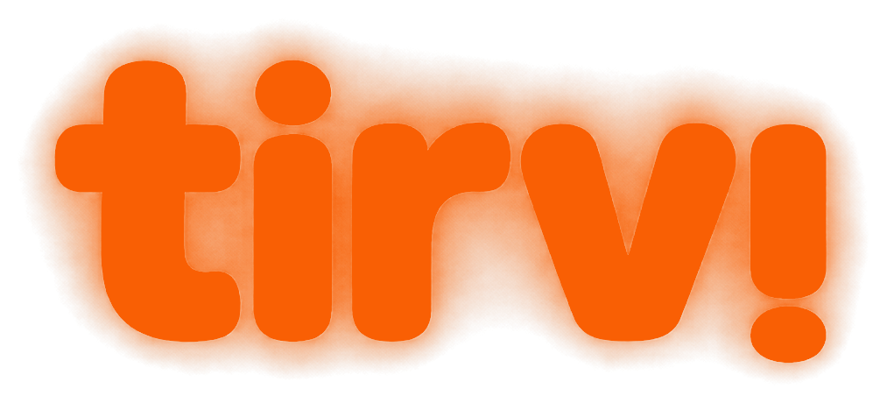

---
pdf_options:
  format: A4
  margin: 0
  printBackground: true
  displayHeaderFooter: false
  preferCSSPageSize: false
body_class: jishu-brief
css: |
  body { margin: 0; padding: 0; }
---

<!-- ========== SHEET 1 — COVER ========== -->
<section class="sheet cover">
  

    

      
      Initiative brief
    

    

      
Hebrew · Dyslexia · Accommodations · Israel

      <h1 class="cover-title">Hebrew exam reading, <em class="accent" style="font-style:italic; font-family: var(--font-display);">redesigned.</em></h1>
      

      
A reader for dyslexic Israeli students that&rsquo;s not human &mdash; but reads like one. The case for tirvi: the gap, the audience, and the structure that closes it.

    

    

      <dl class="cover-meta">
        
<dt>Author</dt><dd>tirvi research</dd>

        
<dt>Published</dt><dd>May 2026</dd>

        
<dt>Status</dt><dd>v1.0 · current</dd>

      </dl>
      
Designed with Jishu &middot; jishutech.io

    

  

</section>

<!-- ========== SHEET 2 — TOC ========== -->
<section class="sheet">
  

    tirvitirvi · initiative brief
    v1.0
  

  
jishutech.io02 / 10

  

    
Contents

    <h2 style="font-size: 32pt; line-height: 1.05;">Inside this brief.</h2>
    
Seven sections, ten pages. The problem, the gap, the moat, and the partnership that makes it real.

  

  <ol class="toc-list" style="margin-top: 12mm;">
    <li>The ProblemWhy generic Hebrew TTS breaks on exam content.p. 03</li>
    <li>Why Hebrew Is HardNo vowels, heavy acronyms, RTL meets LTR.p. 04</li>
    <li>Market SizeThe accommodation cohort, by the numbers.p. 05</li>
    <li>The GapGeneric readers, generic results &mdash; a comparison.p. 06</li>
    <li>The SolutionDon&rsquo;t add TTS to OCR. Add a brain.p. 07</li>
    <li>The MoatFive micro-stages between text and audio.p. 08</li>
    <li>Prototype &amp; PathWhere we are, what comes next.p. 09</li>
  </ol>
</section>

<!-- ========== SHEET 3 — THE PROBLEM ========== -->
<section class="sheet">
  

    tirvi01 · The Problem
    v1.0
  

  
jishutech.io03 / 10

  
01 / Problem

  <h2 style="font-size: 30pt; line-height: 1.08; max-width: 145mm;">Hebrew exam reading is broken.</h2>
  
Israeli students with dyslexia are entitled to a human reader during exams. When the human is replaced by software, today&rsquo;s software fails them &mdash; not because Hebrew TTS is bad, but because no one wired Hebrew NLP into a reader that understands an exam.

  

    

      <h3 style="margin-bottom: 4mm;">Three reasons today&rsquo;s tools don&rsquo;t work</h3>
      <ul style="font-size: 10.5pt; line-height: 1.55; padding-left: 4mm; margin: 0;">
        <li><b>Pronunciation guesses.</b> Hebrew is written without vowels. Generic TTS guesses, gets homographs wrong, and a dyslexic ear can&rsquo;t recover from the error.</li>
        <li><b>Flat reading.</b> Question stems, answer choices, table cells, math &mdash; all read top-to-bottom as one stream. A human reader re-reads the choices on demand. Software doesn&rsquo;t.</li>
        <li><b>No accommodation-grade UX.</b> No replay-this-sentence, no slow-this-word, no jump-to-question, no word-sync highlight. Public criticism of Israel&rsquo;s 2024 computerized-reading pilot says it directly.</li>
      </ul>
    

    

      

        &ldquo;Cold, rigid, not adjustable in real time.&rdquo;
        <cite>Public criticism &mdash; Israeli MoE 2024 computerized-reading pilot for Bagrut math, replacing human readers for students with dyscalculia / dysgraphia. Ynet, 2024.</cite>
      

    

  

  

    
54%

    
of Israeli high-schoolers received Bagrut accommodations in 2021 &mdash; up from 35% in 2011. Level-1 accommodations alone jumped 8% &rarr; 40% (2016&ndash;2021).Taub Center, 2024 &middot; Bagrut Exam Accommodations

  

</section>

<!-- ========== SHEET 4 — WHY HEBREW IS HARD ========== -->
<section class="sheet">
  

    tirvi01.1 · The hidden hardness
    v1.0
  

  
jishutech.io04 / 10

  
01.1 / Why Hebrew Is Hard

  <h2 style="font-size: 28pt; line-height: 1.08; max-width: 165mm;">Three things English readers never face.</h2>
  
English TTS works because English on the page already encodes the pronunciation. Hebrew doesn&rsquo;t. The reader has to think before it can speak.

  

    <svg width="170mm" height="58mm" viewBox="0 0 480 165" xmlns="http://www.w3.org/2000/svg" style="font-family: var(--font-display);">
      <rect x="195" y="60" width="90" height="46" rx="4" fill="#F4ECE0" stroke="#2B211A" stroke-width="1.4"/>
      <text x="240" y="78" text-anchor="middle" font-size="9" font-family="JetBrains Mono" fill="#7B6E5E" letter-spacing="2">UNDIACRITIZED</text>
      <text x="240" y="100" text-anchor="middle" font-size="22" font-weight="500" fill="#2B211A" font-family="Newsreader, David, serif" direction="rtl">ספר</text>
      <line x1="200" y1="83" x2="80" y2="32" stroke="#C35A3A" stroke-width="1.4"/>
      <line x1="200" y1="83" x2="80" y2="83" stroke="#C35A3A" stroke-width="1.4"/>
      <line x1="200" y1="83" x2="80" y2="134" stroke="#C35A3A" stroke-width="1.4"/>
      <rect x="0" y="10" width="170" height="44" rx="3" fill="#FAF4EB" stroke="#E8A88F" stroke-width="1"/>
      <text x="12" y="26" font-size="7" font-family="JetBrains Mono" fill="#A64828" letter-spacing="2">SÉFER · NOUN</text>
      <text x="12" y="42" font-size="13" font-weight="500" fill="#2B211A" font-family="Newsreader, David, serif" direction="rtl">סֵפֶר</text>
      <text x="80" y="42" font-size="9" fill="#2B211A" font-style="italic" font-family="Newsreader, serif">— book</text>
      <rect x="0" y="61" width="170" height="44" rx="3" fill="#FAF4EB" stroke="#E8A88F" stroke-width="1"/>
      <text x="12" y="77" font-size="7" font-family="JetBrains Mono" fill="#A64828" letter-spacing="2">SAFÁR · VERB</text>
      <text x="12" y="93" font-size="13" font-weight="500" fill="#2B211A" font-family="Newsreader, David, serif" direction="rtl">סָפַר</text>
      <text x="80" y="93" font-size="9" fill="#2B211A" font-style="italic" font-family="Newsreader, serif">— he counted</text>
      <rect x="0" y="112" width="170" height="44" rx="3" fill="#FAF4EB" stroke="#E8A88F" stroke-width="1"/>
      <text x="12" y="128" font-size="7" font-family="JetBrains Mono" fill="#A64828" letter-spacing="2">SAPÉR · IMPER.</text>
      <text x="12" y="144" font-size="13" font-weight="500" fill="#2B211A" font-family="Newsreader, David, serif" direction="rtl">סַפֵּר</text>
      <text x="80" y="144" font-size="9" fill="#2B211A" font-style="italic" font-family="Newsreader, serif">— tell!</text>
      <line x1="295" y1="83" x2="395" y2="83" stroke="#2B211A" stroke-width="1.4" marker-end="url(#arr)"/>
      <defs><marker id="arr" markerWidth="10" markerHeight="10" refX="8" refY="3" orient="auto"><path d="M0,0 L8,3 L0,6 z" fill="#2B211A"/></marker></defs>
      <rect x="395" y="55" width="85" height="56" rx="3" fill="#F6E0D4" stroke="#C35A3A" stroke-width="1.4"/>
      <text x="437" y="73" text-anchor="middle" font-size="7" font-family="JetBrains Mono" fill="#A64828" letter-spacing="2">+ CONTEXT</text>
      <text x="437" y="92" text-anchor="middle" font-size="9.5" fill="#2B211A" font-family="Manrope, sans-serif">DictaBERT</text>
      <text x="437" y="105" text-anchor="middle" font-size="9.5" fill="#2B211A" font-family="Manrope, sans-serif">+ Nakdan</text>
    </svg>
  

  

    
01 · No vowels<h3>Same letters, three readings.</h3>
Hebrew omits ניקוד. ספר is book / counted / tell. Only morphology + context can choose. Generic TTS picks one and ships it.

    
02 · Acronyms<h3>Heavy density, idiomatic expansion.</h3>
ד״ר &rarr; doctor, עמ׳ &rarr; page, מס׳ &rarr; number. Generic TTS spells them letter-by-letter. Hebrew exam content is full of them.

    
03 · Mixed direction<h3>RTL meets LTR, mid-sentence.</h3>
Bagrut math and English mix Hebrew with English, numbers, formulas. Google&rsquo;s SSML <code>&lt;lang&gt;</code> tag returns silence on Hebrew. One sentence, three scripts, no clean handover.

  

</section>

<!-- ========== SHEET 5 — MARKET SIZE ========== -->
<section class="sheet">
  

    tirvi02 · The cohort
    v1.0
  

  
jishutech.io05 / 10

  
02 / Market Size

  <h2 style="font-size: 28pt; line-height: 1.08;">The accommodation cohort, by the numbers.</h2>
  
Israel formally classifies more dyslexic students than almost any peer system, and the share is still rising.

  

    

      ~500K
      Israeli students estimated to have dyslexia &mdash; about three to five in every class of thirty.
      Israel National News
    

    

      54<small>%</small>
      of Israeli high-schoolers received Bagrut accommodations in 2021 &mdash; vs. ~15% international LD prevalence.
      Taub Center · 2024
    

    

      +19<small>pp</small>
      growth in the accommodation rate over a decade (2011 &rarr; 2021), driven by Level-1 accommodations.
      Taub Center · 2024
    

  

  <h3 style="margin: 10mm 0 4mm 0; font-size: 13pt;">Bagrut accommodations rate, Israeli high-schoolers</h3>
  

    <svg width="170mm" height="58mm" viewBox="0 0 510 175" xmlns="http://www.w3.org/2000/svg">
      <line x1="40" y1="150" x2="500" y2="150" stroke="#2B211A" stroke-width="1.2"/>
      <text x="32" y="153" text-anchor="end" font-size="8" font-family="JetBrains Mono" fill="#7B6E5E">0</text>
      <text x="32" y="115" text-anchor="end" font-size="8" font-family="JetBrains Mono" fill="#7B6E5E">20</text>
      <text x="32" y="80" text-anchor="end" font-size="8" font-family="JetBrains Mono" fill="#7B6E5E">40</text>
      <text x="32" y="45" text-anchor="end" font-size="8" font-family="JetBrains Mono" fill="#7B6E5E">60%</text>
      <line x1="40" y1="115" x2="500" y2="115" stroke="#E0D4C0" stroke-width="0.6" stroke-dasharray="2 2"/>
      <line x1="40" y1="80" x2="500" y2="80" stroke="#E0D4C0" stroke-width="0.6" stroke-dasharray="2 2"/>
      <line x1="40" y1="45" x2="500" y2="45" stroke="#E0D4C0" stroke-width="0.6" stroke-dasharray="2 2"/>
      <rect x="80" y="89" width="80" height="61" fill="#EAE0D0" stroke="#A64828" stroke-width="0.8"/>
      <text x="120" y="84" text-anchor="middle" font-size="11" font-family="Newsreader, serif" font-weight="500" fill="#2B211A">35%</text>
      <text x="120" y="166" text-anchor="middle" font-size="9" font-family="JetBrains Mono" fill="#7B6E5E" letter-spacing="2">2011</text>
      <rect x="220" y="71" width="80" height="79" fill="#E8A88F" stroke="#A64828" stroke-width="0.8"/>
      <text x="260" y="66" text-anchor="middle" font-size="11" font-family="Newsreader, serif" font-weight="500" fill="#2B211A">~45%</text>
      <text x="260" y="166" text-anchor="middle" font-size="9" font-family="JetBrains Mono" fill="#7B6E5E" letter-spacing="2">2016</text>
      <rect x="360" y="55" width="80" height="95" fill="#C35A3A" stroke="#A64828" stroke-width="0.8"/>
      <text x="400" y="50" text-anchor="middle" font-size="11" font-family="Newsreader, serif" font-weight="500" fill="#2B211A">54%</text>
      <text x="400" y="166" text-anchor="middle" font-size="9" font-family="JetBrains Mono" fill="#7B6E5E" letter-spacing="2">2021</text>
      <line x1="160" y1="89" x2="350" y2="60" stroke="#A64828" stroke-width="1.2" stroke-dasharray="3 2" marker-end="url(#arr2)"/>
      <defs><marker id="arr2" markerWidth="10" markerHeight="10" refX="8" refY="3" orient="auto"><path d="M0,0 L8,3 L0,6 z" fill="#A64828"/></marker></defs>
      <text x="500" y="85" text-anchor="end" font-size="10" font-family="Newsreader, serif" font-style="italic" fill="#A64828">+19pp</text>
      <text x="500" y="100" text-anchor="end" font-size="7" font-family="JetBrains Mono" fill="#7B6E5E" letter-spacing="1.6">10-YEAR DELTA</text>
    </svg>
  

  
SOURCE · TAUB CENTER 2024 · BAGRUT EXAM ACCOMMODATIONS

</section>

<!-- ========== SHEET 6 — THE GAP ========== -->
<section class="sheet">
  

    tirvi02.1 · The Gap
    v1.0
  

  
jishutech.io06 / 10

  
02.1 / Existing Tools

  <h2 style="font-size: 28pt; line-height: 1.08;">Generic readers, generic results.</h2>
  
No commercial product today combines Hebrew OCR, Hebrew NLP, and Hebrew TTS into an exam-shaped reader. The building blocks exist. No one has wired them together.

  <table class="cmp" style="margin-top: 8mm;">
    <thead><tr>
      <th style="width: 38mm;">Tool</th>
      <th>Hebrew TTS</th>
      <th>Exam structure</th>
      <th>Diacritization</th>
      <th>Word-sync</th>
      <th>Verdict</th>
    </tr></thead>
    <tbody>
      <tr><td>ElevenLabs (v3, Flash v2.5)</td><td></td><td></td><td></td><td></td><td>Generic API</td></tr>
      <tr><td>Speechify</td><td></td><td></td><td></td><td></td><td>Generic article reader</td></tr>
      <tr><td>NaturalReader</td><td></td><td></td><td></td><td></td><td>Generic doc TTS</td></tr>
      <tr><td>Voice Dream Scanner</td><td></td><td></td><td></td><td></td><td>Hebrew not supported</td></tr>
      <tr><td>Kurzweil 3000</td><td></td><td></td><td></td><td></td><td>No Hebrew voice</td></tr>
      <tr><td>MS Immersive Reader</td><td></td><td></td><td></td><td></td><td>RTL layout issues</td></tr>
      <tr><td>Read&amp;Write (Texthelp)</td><td></td><td></td><td></td><td></td><td>No first-class Hebrew</td></tr>
      <tr><td>Israeli MoE 2024 pilot</td><td></td><td></td><td></td><td></td><td>&ldquo;Cold, rigid, not adjustable&rdquo;</td></tr>
      <tr class="tirvi"><td>tirvi</td><td></td><td></td><td></td><td></td><td>Built for Hebrew exams</td></tr>
    </tbody>
  </table>
  

     &nbsp; Full support
     &nbsp; Partial / limited
     &nbsp; None
  

  
The building blocks &mdash; DictaBERT, Dicta-Nakdan, Phonikud, Google he-IL TTS &mdash; all exist. No one has assembled them into a vertically integrated reader for exam content. &mdash; tirvi research synthesis &middot; may 2026

</section>

<!-- ========== SHEET 7 — THE SOLUTION ========== -->
<section class="sheet">
  

    tirvi03 · The Solution
    v1.0
  

  
jishutech.io07 / 10

  
03 / Solution

  <h2 style="font-size: 30pt; line-height: 1.08;">Don&rsquo;t add TTS to OCR. <em class="accent" style="font-style: italic;">Add a brain.</em></h2>
  
The defensible layer is the middle stage &mdash; Hebrew morphology, disambiguation, diacritization, and reading-plan shaping. OCR and TTS are commodities behind adapters.

  

    

      01 · Ingest
      <h4>Hebrew OCR</h4>
      
Tesseract <code style="font-family: var(--font-mono); font-size: 8pt;">heb</code> default; Document AI fallback for hard scans. Structured blocks + bboxes, not flat text.

    

    

      02 · Interpret &mdash; the moat
      <h4>Hebrew NLP</h4>
      
DictaBERT for morphology &amp; disambiguation. Dicta-Nakdan for ניקוד. Phonikud for stress + IPA G2P.

    

    

      03 · Shape
      <h4>Reading Plan</h4>
      
Per-block JSON: tokens, lemma, POS, pronunciation hints, SSML cues, structural type (question / answer / table).

    

    

      04 · Voice
      <h4>Hebrew TTS</h4>
      
Google Wavenet for word-sync today. Chirp 3 HD and Azure as design-stage alternatives. Cache by content hash for cost discipline.

    

    

      05 · Listen
      <h4>Player</h4>
      
Side-by-side viewer, word-sync highlight, per-block playback, repeat sentence, font-size, WCAG 2.2 AA.

    

  

  

    

      <h3 style="font-size: 13pt; margin-bottom: 3mm;">The three principles that decide it</h3>
      <ul style="font-size: 10pt; line-height: 1.55; padding-left: 4mm; margin: 0;">
        <li><b>The reading plan is the product.</b> 3&times; as much code in the interpretation layer as in adapters.</li>
        <li><b>Adapters return rich result objects, not bytes.</b> Timepoints, bboxes, confidences survive the port boundary.</li>
        <li><b>Cache by content hash, share across users.</b> The single biggest cost lever and the only way the $0.02 / page target survives premium voices.</li>
      </ul>
    

    

      <h3 style="font-size: 13pt; margin-bottom: 3mm;">Why now</h3>
      <ul style="font-size: 10pt; line-height: 1.55; padding-left: 4mm; margin: 0;">
        <li><b>2024 MoE pilot</b> proved the policy direction (digital readers) and the UX gap (cold, rigid).</li>
        <li><b>Dicta lineage</b> (Bar-Ilan) shipped DictaBERT 2.0 in 2024 &mdash; SOTA on UD-Hebrew.</li>
        <li><b>Phonikud</b> (June 2025) gives real-time Hebrew G2P with stress &amp; vocal shva &mdash; the missing layer.</li>
        <li><b>Google Chirp 3 HD he-IL</b> shipped in 2025 &mdash; premium voice quality at last.</li>
      </ul>
    

  

</section>

<!-- ========== SHEET 8 — THE MOAT ========== -->
<section class="sheet">
  

    tirvi03.1 · The Moat
    v1.0
  

  
jishutech.io08 / 10

  
03.1 / The moat &mdash; Hebrew Reading Plan

  <h2 style="font-size: 26pt; line-height: 1.08;">Five micro-stages between text and audio.</h2>
  
This is where context-aware Hebrew reading happens &mdash; morphological disambiguation, pronunciation prediction, exam-domain adaptation. The academic framing matches the engineering one.

  

    
01 · Tokenize<h3 style="font-size: 11pt;">Morphology</h3>
DictaBERT-large-joint &mdash; segmentation, POS, lemma, dependency. SOTA on UD-Hebrew 2024&ndash;25.

    
02 · Disambiguate<h3 style="font-size: 11pt;">Context</h3>
Sentence context picks the right reading for homographs. ספר &rarr; verb or noun?

    
03 · Diacritize<h3 style="font-size: 11pt;">Add ניקוד</h3>
Dicta-Nakdan adds vowels for ambiguous tokens. ~86.86% word-level accuracy.

    
04 · G2P<h3 style="font-size: 11pt;">Phonemes</h3>
Phonikud (June 2025) outputs IPA with stress and vocal shva. Real-time, plug into any TTS.

    
05 · Shape<h3 style="font-size: 11pt;">SSML</h3>
Breaks between answers, emphasis on question numbers, language switch on English spans, mark for word-sync.

  

  <h3 style="margin: 12mm 0 4mm 0; font-size: 13pt;">Worked example &mdash; one Bagrut question stem</h3>
  

    

      
INPUT

      
ספר את הסיפור במילים שלך.

      
DISAMBIGUATED

      
סַפֵּר אֶת הַסִּיפּוּר בְּמִלִּים שֶׁלָּךְ. &mdash; "tell the story in your own words" (verb sapér, not noun séfer)

      
SSML

      
&lt;mark name="q4-w0"/&gt;&lt;emphasis level="moderate"&gt;סַפֵּר&lt;/emphasis&gt; אֶת הַסִּיפּוּר &lt;break time="200ms"/&gt; בְּמִלִּים שֶׁלָּךְ.

      
SPOKEN

      
"sa<b>pér</b> et ha-sipúr be-milím shelákh"

    

  

</section>

<!-- ========== SHEET 9 — THE PROTOTYPE ========== -->
<section class="sheet">
  

    tirvi04 · Prototype
    v1.0
  

  
jishutech.io09 / 10

  
04 / Prototype

  <h2 style="font-size: 30pt; line-height: 1.08;">A humble prototype. <em class="accent" style="font-style: italic;">A real pipeline.</em></h2>
  
A working end-to-end prototype runs today on a sample Bagrut page &mdash; Hebrew OCR, full NLP, diacritization, G2P, and word-synchronized playback. The moat is built and tested. The product around it is the next eighteen months of work.

  <h3 style="margin: 10mm 0 4mm 0; font-size: 13pt;">Three horizons of work</h3>

  

    

      Today &middot; live
      <h3>The moat, working.</h3>
      
Hebrew OCR with layout post-processing. DictaBERT morphology and disambiguation. Dicta-Nakdan diacritization. Phonikud IPA G2P. Reading-plan assembly. Google Wavenet TTS with per-word marks. Browser playback with synchronized word highlight.

    

    

      Next &middot; 16 weeks
      <h3>The product around it.</h3>
      
Document AI fallback for hard scans. Premium voice alternatives. Content-hash audio cache. Full block taxonomy &mdash; questions, answers, tables, figures. Side-by-side viewer. Accessibility controls. WCAG 2.2 AA pass.

    

    

      Horizon &middot; v2
      <h3>The validation layer.</h3>
      
tirvi-Hebrew-Exam Benchmark v0. Blind MOS evaluation with a panel of dyslexic teen readers. First institutional pilot. DPIA, parental consent &ge;14, third-party copyright attestation.

    

  

  
The hardest part &mdash; Hebrew context-aware reading &mdash; is solved. What remains is the slower, less glamorous work of evaluation, accessibility polish, and earning the trust of the institutions that serve dyslexic students.

  
tirvi research synthesis &middot; may 2026

</section>

<!-- ========== SHEET 10 — THE PATH FORWARD ========== -->
<section class="sheet">
  

    tirvi05 · The Path
    v1.0
  

  
jishutech.io10 / 10

  
05 / The path

  <h2 style="font-size: 32pt; line-height: 1.08;">Built in partnership.</h2>
  
tirvi is too narrow to scale through venture economics, and too engineered to live as a research paper. The structure that fits is a focused Israeli nonprofit, anchored by academic, industry, and public partners.

  <h3 style="margin: 8mm 0 3mm 0; font-size: 13pt;">Three pillars of partnership</h3>
  

    

      01 &middot; Research
      <h3>Academic anchor.</h3>
      
A Hebrew NLP lab as research partner &mdash; disambiguation accuracy, diacritization evaluation, benchmark co-design. Linguistics faculty for pronunciation and accommodation-grade quality. Computer-science and linguistics students as paid contributors.

    

    

      02 &middot; Engineering
      <h3>Industry partner.</h3>
      
Cloud and runtime sponsorship &mdash; TTS, OCR, GPU inference. AI engineering mentorship. Production deployment advisory. A co-branded social-impact program with a clear AI-talent and CSR story for the partner.

    

    

      03 &middot; Reach
      <h3>Public sponsor.</h3>
      
A university accessibility centre, a municipality, or a foundation aligned with disability and education. The first institutional pilot &mdash; students using the tool in real practice settings, with formal evaluation.

    

  

  <h3 style="margin: 8mm 0 3mm 0; font-size: 13pt;">First-year commitments sought</h3>
  <table class="cmp" style="margin-top: 1mm;">
    <thead><tr>
      <th style="width: 38mm;">From</th>
      <th>Commitment</th>
      <th style="width: 56mm;">Outcome</th>
    </tr></thead>
    <tbody>
      <tr><td>Academic anchor</td><td>One faculty advisor, two graduate-student researchers, evaluation methodology</td><td>Peer-reviewable accuracy benchmark</td></tr>
      <tr><td>Industry partner</td><td>Compute credits, runtime sponsorship, one AI engineer as technical advisor</td><td>Production-grade deployment</td></tr>
      <tr><td>Public sponsor</td><td>Pilot site, 10&ndash;20 dyslexic student participants, institutional cover</td><td>Validated 6-month pilot results</td></tr>
      <tr class="tirvi"><td>tirvi initiative</td><td>The full pipeline, the engineering team, the open-source codebase</td><td>A sustained, accommodation-grade Hebrew reader</td></tr>
    </tbody>
  </table>

  

    <dl>
      <dt>Document</dt><dd>tirvi · Initiative Brief · v1.0</dd>
      <dt>Status</dt><dd>Prototype complete · seeking founding partners</dd>
      <dt>Repository</dt><dd>VSProjects/tirvi · open-source on launch</dd>
      <dt>Approach</dt><dd>Israeli nonprofit (עמותה) · academic + industry + public anchors</dd>
      <dt>Next step</dt><dd>30-minute walkthrough of the prototype + structure</dd>
    </dl>
    
tirvi · May 2026 · v1.0jishutech.io

  

</section>
