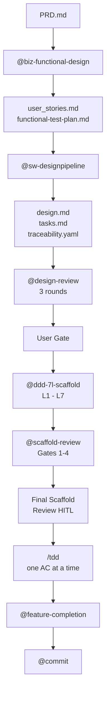
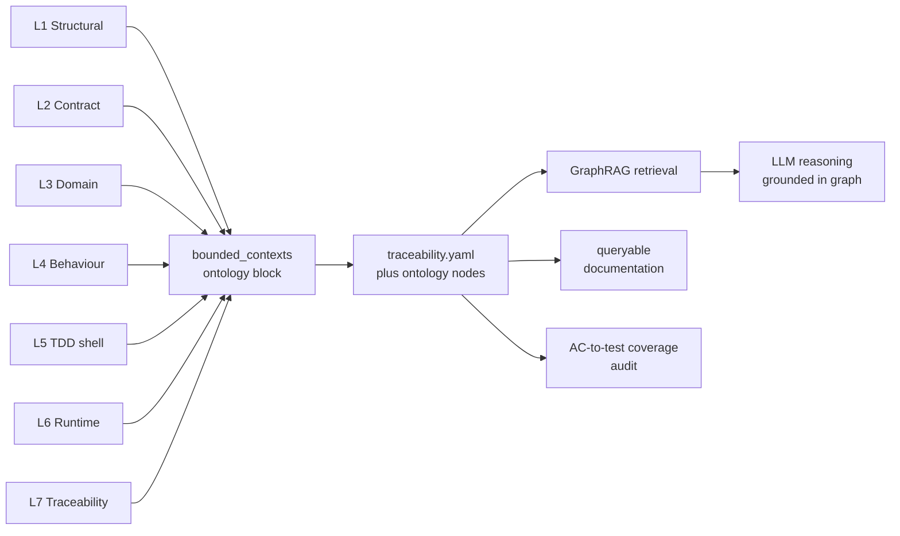

# How You Could Do Better

Position paper · Agentic Software Engineering · April 2026

If you let an LLM agent design, code and test a complex feature in one sequential pass, you are casting a delicate sculpture into a single mould. There is a better way — borrowed from how 3D printers, biological tissues and fractals achieve complexity. This paper introduces it.

---

## Abstract

Most current LLM-driven software development pipelines move sequentially from design specification to implementation to test, treating intermediate construction as plumbing. This paper argues that the sequential approach is a structural bottleneck for agentic coding: it concentrates the highest-leverage architectural decisions into the moment when context is most fragmented and review is most absent. Drawing on Q1 peer-reviewed evidence from software engineering, additive manufacturing, materials science, theoretical biology and applied mathematics, we propose **Agentic Layering (AL)** — a seven-layer construction method, mediated by a code-scaffold skill that sits between approved design and test-driven implementation. The method's central claim, supported by an inter-disciplinary citation base, is that complex delicate systems are better fabricated layer by layer with per-layer review than monolithically. We further demonstrate that the method produces a knowledge graph as a free byproduct — *ontology icecracking* — and we connect this to the rapidly maturing literature on graph-augmented language models. We close with limitations, threats to validity, and a research agenda.

**Keywords**: agentic software engineering, domain-driven design, additive manufacturing, layered construction, fractal architecture, knowledge graph, ontology, LLM grounding.

---

## 1. Introduction

The dominant pattern in agentic software development today is sequential. A user states an intent. An agent (or a chain of agents) drafts a design. The same agent, often without explicit checkpoints, writes the code. A separate or co-located test phase exercises the result. The pattern is appealingly simple, easy to depict in tutorials, and corresponds to a developer's mental model of "write some code, then test it." It is also wrong for non-trivial systems — and the empirical cost of being wrong is now measurable.

This paper has three goals. **First**, to make the structural failure mode of sequential agentic coding explicit, with citations to Q1 peer-reviewed evidence. **Second**, to introduce *Agentic Layering* (AL): a seven-layer construction method, embodied in a Claude Code skill (`@ddd-7l-scaffold`), that interposes structured layered scaffolding between approved design and TDD. **Third**, to argue — by analogy to additive manufacturing, biological hierarchical materials and fractal mathematics, and with empirical support from each domain — that the layered approach is not stylistic preference but a structurally superior method for complex, delicate construction. As a closing observation, we note that AL produces a knowledge graph as a byproduct, and we connect this to recent work on graph-augmented LLM reasoning.

---

## 2. The state of the art: sequential agentic software development

### 2.1 The conventional pattern

The conventional pipeline for agentic software construction has three phases. **Design**: an agent (or human) produces a specification — user stories, acceptance criteria, possibly a functional design document. **Code**: the agent generates implementation code, sometimes with an internal scratchpad, sometimes file by file. **Test**: a test suite is generated, executed, and used to validate the implementation. Variants exist (test-first variants invert phases two and three; review variants insert a critic agent), but the load-bearing structure is sequential: the agent finishes one phase before starting the next.

The pattern's appeal is its alignment with how developers describe their work in casual conversation. Its weakness is that the description was always inaccurate even for human developers: skilled engineers move continuously between design, implementation, and test in tight cycles, with constant micro-revision of all three. For LLM agents, however, the pattern is implemented literally, and the inaccuracy becomes a structural defect.

### 2.2 Documented limitations

The empirical software engineering literature now contains direct evidence of the failure modes the sequential pattern produces.

**Context fragmentation.** Liu et al. (2024) demonstrate experimentally that LLM performance "degrades significantly when models must access relevant information in the middle of long contexts," producing the characteristic U-shaped accuracy curve in long-context retrieval [^1]. The implication for agentic coding is direct: design intent placed mid-sequence is systematically less accessible than intent at the prompt's beginning or end. A long-running design-to-code pipeline drops architectural commitments along the way, not because the model "forgets" but because position-based attention attenuates them.

**Class-level / dependency-chain failure.** Du et al. (2024) introduce ClassEval, the first benchmark targeting class-level (multi-method, interdependent) code generation, and report that "all existing LLMs show much worse performance on class-level code generation compared to on standalone method-level code generation benchmarks" [^2]. Method-level scores do not predict class-level competence. Sequential agentic pipelines that pass method-level checks therefore offer no guarantee that the integrated structure is sound.

**Long-horizon resolution failure.** Jimenez et al. (2024), in the SWE-bench evaluation accepted as an oral at ICLR, document that real-world GitHub issues — which "frequently require understanding and coordinating changes across multiple functions, classes, and even files simultaneously" — were resolved by the best 2024 model in only 1.96% of cases [^3]. Even after substantial improvement, models fail catastrophically on tasks whose solutions span more than a small handful of structural elements.

**Interface-mediated structural inadequacy.** Yang et al. (2024) at NeurIPS show that the same models with purpose-built agent-computer interfaces achieve roughly 12.5% pass rates on SWE-bench, versus near-zero without — establishing that single-pass, interface-poor generation systematically lacks the structural review loop needed for coherent repository edits [^4].

**Hallucination compounding at repository scale.** Zhang et al. (2025) at ISSTA 2025 publish the first empirical taxonomy of LLM hallucinations specifically at the repository level, showing that hallucinations cluster around "complex contextual dependencies in practical development process" and cascade through dependent code units [^5]. The errors do not stay local; they propagate.

**Specification → implementation drift.** Tian and Chen (2025), in work accepted to ICSE 2026, name and quantify the *specification perception gap*: "LLM-generated code often fails to fully align with the provided specification… [models] overlook the critical issue of specification perception, resulting in persistent misalignment issues" [^6].

These six findings, drawn from CORE A* / Q1 venues, form a converging picture. The sequential pattern fails in a specific, predictable way: it produces working-but-incoherent code whose architectural defects are *structural* rather than *behavioural*, and whose cost compounds the further the pipeline runs without intermediate review.

---

## 3. Distillation: what we are trying to improve

The defects above share a single shape. They appear when a complex *structural* decision — aggregate boundary, port granularity, test-to-AC mapping, runtime separation — is made implicitly during a generative pass and only surfaces during downstream evaluation. By that point, the decision is encoded across many files, many tests, many call sites; reverting it costs a multiple of the original generation budget. Boehm's classic defect-cost-escalation curve is well known to software engineering as a phenomenon of late-discovered bugs; the agentic version is its more aggressive cousin, because LLM-generated code is cheaper to produce and therefore tends to be produced in larger volume per unit of structural decision.

What we want to improve is precisely this asymmetry. We want a method that **front-loads the structural decisions, exposes them for review at the moment of formation, and prevents downstream generation against an unreviewed shape**. The method should not slow down the cheap parts of the pipeline (writing the actual implementation, which TDD already handles). It should slow down — or rather, *gate* — the expensive parts, the moments where shape becomes locked in.

---

## 4. The 3D-printer analogy

### 4.1 Why additive manufacturing succeeds where casting fails

Modern engineering relies increasingly on additive manufacturing (AM) — *3D printing* in popular usage — for components whose geometry cannot be produced by subtractive machining or casting. Ngo et al. (2018), in a frequently cited Q1 review in *Composites Part B: Engineering*, summarize the design-freedom argument: "Freedom of design, mass customisation, waste minimisation and the ability to manufacture complex structures… are the main benefits of additive manufacturing" [^7]. Internal lattices, embedded coolant channels, undercut geometries — these are routine in AM and impossible in single-step casting. The reason is not novelty of material; it is novelty of *construction order*. Layered deposition lets each layer's interior become the next layer's exterior, recursively, until topologies that no monolithic process can produce are achieved.

The mapping to software is exact. A monolithic sequential pipeline that emits a finished implementation in one pass is constrained to architectures it can describe in a single forward generation. A layered pipeline that gates each structural commitment can compose architectures whose interiors — separation between domain and infrastructure, invariant placement, port granularity — are decided by sequential review and never need to be recovered post-hoc.

### 4.2 Bioprinting: complexity from sequential layered deposition

The most striking demonstration of layered construction's power comes from 3D bioprinting. Murphy and Atala (2014), in a landmark *Nature Biotechnology* review, document how living tissue composed of differentiated cell layers can be fabricated by precise layered deposition: "Recent advances have enabled 3D printing of biocompatible materials, cells and supporting components into complex 3D functional living tissues" [^8]. No bulk-mixing process produces functional tissue; the biology requires correct *placement* of correct *cells* at correct *layers*, and the only known route to that fidelity is sequential deposition.

Grigoryan et al. (2019), publishing in *Science*, sharpen the claim. They produced interlocking vascular networks — entangled blood-vessel and airway architectures with no monolithic analogue — via stereolithographic layer-by-layer construction, and demonstrated functional gas exchange in a lung-mimicking construct [^9]. The architectural complexity was not pre-designed and then "fabricated"; it *emerged* from the layered process.

Kim et al. (2024) extend the principle to functionally graded interfaces. A tendon-to-bone interface — biology's example of a graded transition between two distinct tissue types — was fabricated only when bioinks of different cell phenotypes were deposited at layer-level resolution; non-graded controls failed to integrate [^12]. The functional gradient was a property of the build order, not the material.

Translated to software: monolithic generation cannot produce architectures that depend on graded transitions between layers (e.g., gradual handoff from domain language to infrastructure language across an anti-corruption layer). Layered generation can, because the gradient is constructed.

### 4.3 In-process per-layer review

Additive manufacturing is so prone to per-layer defect propagation that an entire literature has formed around in-process monitoring. Peng et al. (2023), reviewing in-situ defect detection for selective laser melting, document that "SLM part quality is affected by many factors, resulting in lack of repeatability and stability," and that in-situ monitoring is the dominant cost-effective gate [^10]. The point is not that AM is unreliable; it is that *each layer can introduce defects that propagate*, and the only economical control is to inspect each layer as it is laid down. Post-build inspection is too late: by then, the defects are sealed inside the part and the entire build must be discarded.

The analogy in software is one-to-one. End-of-pipeline code review catches structural defects when they are most expensive to fix. Per-layer review during construction catches them when they are still cheap. The ratio between the two costs is empirically large in AM and we contend it is empirically large in agentic coding for the same structural reason.

### 4.4 Hierarchical biological precedents

Wegst et al. (2015), in a major Q1 *Nature Materials* review, document the convergent evolution of layered hierarchical construction across biological structural materials: "Natural structural materials are built at ambient temperature from a fairly limited selection of components… arranged in complex hierarchical architectures, with characteristic dimensions spanning from the nanoscale to the macroscale" [^11]. Bone, nacre, wood, bamboo all achieve toughness values that exceed those of their constituent materials by orders of magnitude — and the mechanism is hierarchical layered structure across multiple scales. The toughness is *constituted by* the layering, not merely permitted by it.

This is not an argument from analogy alone. It is an argument that a structural property of nature's most successful complex materials is layered hierarchy, achieved through sequential deposition with per-layer biochemical checkpoints. We claim software architecture in DDD-shaped domains exhibits the same property: robustness emerges from hierarchical layered construction with per-layer review, and is not recoverable from monolithic processes.

---

## 5. Mathematical foundations

The 3D-printing analogy is not metaphor for its own sake; it sits inside a deeper mathematical literature on how complex structures arise from local recursive rules. Three results are foundational.

### 5.1 Self-similarity and iterated function systems

Hutchinson (1981), in the *Indiana University Mathematics Journal*, proved that self-similar sets — fractals — are exactly the fixed points of iterated function systems (IFS): finite collections of contraction mappings applied recursively [^13]. The implication is profound: a finite, small set of local rules, applied at every scale, generates structures of unbounded complexity, with provable properties at every scale. The structure is not "compressed" by the rules; the rules *are* the structure.

For software, the corollary is that a finite, well-chosen set of layered construction rules, applied at every gate of every feature, can generate large coherent architectures whose properties are predictable from the rules themselves. This is the formal version of the AL claim that layered review at fixed gates produces invariant structural quality.

### 5.2 Fractality of complex networks

Song, Havlin and Makse (2006), in *Nature Physics*, demonstrate that real complex networks — biological, technological — are fractal under renormalization, and that "a robust network comprising functional modules… necessitates a fractal topology, suggestive of an evolutionary drive for their existence" [^14]. The result establishes that hierarchical modularity is not an aesthetic preference but a robustness requirement for complex networked systems.

A software system is a complex network. By the Song et al. argument, its robustness depends on hierarchical modular structure with self-similar review across scales. The seven-layer scaffold is one such structure.

### 5.3 L-systems and emergent complexity from local rules

Lindenmayer (1968), in the *Journal of Theoretical Biology*, introduced L-systems: parallel rewriting grammars in which "the state of a cell at a given time is determined by… the states of its immediate neighbours" [^15]. Local production rules, applied identically at each step, generate the global branching structure of plants and the morphogenesis of multicellular organisms. The complexity is not authored; it is *generated* by the rules.

The implication for AL is that the right set of layer-construction rules, applied at every layer of every feature, can generate features of high complexity without explicit per-feature design effort. Each feature is a developmental path through the rule system; the rules are stable across features.

### 5.4 Hierarchical manifold learning

Zhang, Shih and Li (2024), in *PNAS Nexus*, formalize hierarchical simplicial manifold learning, showing that faithful global topology is recovered through "nested clustering and topological reduction" — local-to-global assembly of structure from interface-respecting layers [^16]. The result is a contemporary mathematical confirmation that layered local construction with proper interface preservation produces faithful global structure. It is the cleanest available formalism for what AL is doing computationally: each layer commits to local structure with well-defined interfaces; the global architecture emerges from layer composition without separate global design.

---

## 6. The method: Agentic Layering

### 6.1 The seven layers

AL decomposes the design-to-TDD construction phase into seven sequential layers. Each layer produces a small, focused, reviewable artefact. The sequence is the same for every feature, mirroring the recursive rule-set property from §5.

| Layer | Output | Purpose |
| ----- | ------ | ------- |
| **L1 Structural** | Bounded-context folders, empty modules, package files | Establish navigable spine; ubiquitous-language naming |
| **L2 Contract** | Interfaces, ports, command/query/result types, typed errors | Lock typed boundaries and dependency direction |
| **L3 Domain** | Aggregates, entities, value objects, domain events, named invariants | Codify DDD tactical model with `NotImplemented` bodies |
| **L4 Behaviour** | Test skeleton files with Given/When/Then comments, AC-named | Pin behavioural intent before TDD writes assertions |
| **L5 TDD shell** | Constructor wiring, fakes, in-memory adapters, fixture builders | Make the codebase compile; failing tests are intentional |
| **L6 Runtime** | API routes, controllers, message handlers, observability stubs | Wire production entry points to use cases |
| **L7 Traceability** | `bounded_contexts` ontology block, full feature graph | Auto-generate the knowledge graph (see §7) |

The strict rule is that **no business logic is written in any layer**. Method bodies raise `NotImplemented`; test bodies are skipped with labelled reasons; route handlers contain only TODO sketches. This constraint preserves layer reviewability: a Gate-2 reviewer examines aggregate shape without wading through invariant validation logic.

### 6.2 The workflow

```mermaid
flowchart LR
    A["Step 2.\nDesign approved"] --> B["L1\nStructural"]
    B --> C["L2\nContract"]
    C --> G1{{"Gate 1\nstructure + contract"}}
    G1 --> D["L3\nDomain"]
    D --> G2{{"Gate 2\ndeep domain review"}}
    G2 --> E["L4\nBehaviour"]
    E --> F["L5\nTDD shell"]
    F --> G3{{"Gate 3\nbehaviour + TDD readiness"}}
    G3 --> H["L6\nRuntime"]
    H --> I["L7\nTraceability"]
    I --> G4{{"Gate 4 final\nscaffold review"}}
    G4 --> J["User Gate HITL"]
    J --> K["Step 3.\n/tdd activates skeletons"]
```

### 6.3 Staged review gates

Four review gates interrupt the layer sequence at predetermined points. The gates are not equally weighted: Gate 2 (after L3) and Gate 4 (after L7) carry the deepest review depth and hold mandatory Human-In-The-Loop checkpoints. Gate 2 catches DDD boundary errors — wrong aggregate ownership, misplaced invariants, primitive obsession — before any test or implementation is written against the wrong shape. Gate 4 catches orphan artefacts and traceability gaps before TDD begins.

The gates are themselves implemented as a separate skill (`@scaffold-review`) that deliberately *skips* the conventional Phase-1 quality gate (because intentional `NotImplemented` failures would block it) and runs a design-aware Phase-2 review across twelve dimensions. The separation is a worked example of why review-skill design must respect the construction-method's intended state.

### 6.4 External gate dependencies

The diagram makes one fact explicit: AL does not replace the design pipeline. It consumes the design pipeline's output and prepares the TDD pipeline's input. It owns one phase only — the construction phase — and is the formal name for what was previously an unnamed handoff.

### 6.5 Assumptions

The method assumes that (a) design has been completed and approved, (b) the design includes acceptance criteria, (c) the project has at least one bounded context implied (otherwise AL is overkill), and (d) the construction language has type system features sufficient to express interfaces, value objects, and result types — true of TypeScript, Python (with Protocols), Go, Rust, Kotlin, Swift, Dart, and others.

For language portability the skill ships with a canonical TypeScript prompt and per-language reference files in `references/{python,go,dart}.md`. New languages are added by following the same per-layer template.

---

## 7. The ontology icecracking

### 7.1 The byproduct that becomes the product

The most surprising property of AL is that L7 produces a complete machine-readable knowledge graph as a byproduct of having executed L1 through L6. Every aggregate generated at L3 becomes a node. Every port at L2 becomes a node with edges to its adapters. Every test at L4 becomes a node with an edge to its acceptance criterion. Every route at L6 becomes a node with an edge to its use case. The graph is not separately authored; it is *written by the construction process itself*, because each layer's strict rule "no orphan artefacts" forces traceability at the moment of creation.

We call this the *ontology icecracking* — the surface ice of the codebase fragments under per-layer pressure into a connected graph of meaning. The name is intentionally unusual because the phenomenon is.

### 7.2 Knowledge-graph-augmented LLM reasoning

The auto-generated ontology is not curiosity; it is a substrate that demonstrably improves LLM reasoning over the codebase.

Peng et al. (2025), in an *ACM TOIS* (Q1) survey, formalize the GraphRAG paradigm and conclude that "GraphRAG leverages structural information across entities to enable more precise and comprehensive retrieval, capturing relational knowledge and facilitating more accurate, context-aware responses" [^17]. Where vector RAG retrieves documents by semantic similarity, GraphRAG traverses the knowledge graph and returns relationally coherent context. For codebases — which are intrinsically relational — the paradigm is a structural fit.

Xu et al. (2025), at ICSE 2025, demonstrate one realization. Their CKGFuzzer system uses a code knowledge graph constructed by interprocedural analysis and reports an 8.73% absolute improvement in code coverage over state-of-the-art baselines, plus an 84.4% reduction in crash-analysis manual workload [^18]. The improvement is attributable to the LLM having access to the structural code KG, not to a larger model.

Guo et al. (2021) at ICLR established the foundational case earlier with GraphCodeBERT. Pre-training on code's data-flow graph rather than its raw token stream produced state-of-the-art results across code search, clone detection, translation and refinement [^19]. The principle is general: graph-structured representations of code outperform token-only representations across downstream tasks.

### 7.3 Hallucination grounding

The same paradigm has been shown empirically to reduce LLM hallucination. Ali et al. (2026), in a Q1 *Journal of Biomedical Informatics* paper, integrate an OWL/RDF ontology with a knowledge graph as the grounding layer for clinical question answering, and document that "the hallucination rate was reduced from approximately 63% in ChatGPT-4 and 48% in DeepSeek-R1 to just 1.7%" [^20]. The mechanism — providing the LLM with a verifiable structured knowledge substrate against which to validate its outputs — is domain-agnostic. We claim the AL-generated ontology serves the analogous function for software-engineering tasks: it is the substrate against which a downstream code-modifying agent can validate that its proposed change is consistent with the established structure.

### 7.4 Documentation that writes itself

A second, less spectacular but more pervasive consequence: the ontology is documentation. Every aggregate is documented by its node in the graph; every port is documented by its edges; every test is documented by its acceptance-criterion linkage. Querying the graph answers operational questions ("which tests cover invariant INV-LA-001?", "which routes call which use cases?", "which bounded contexts depend on which others?") without separate documentation effort. The documentation maintenance problem dissolves into the construction process.

This is the cherry on top — the icecracking — but it is also a practical capability that pays for the method's overhead in its own right.

---

## 8. Limitations and critical reflection

We owe the reader a clear-eyed assessment of where the argument is strong and where it is weaker.

**Empirical validation gap.** No randomized controlled trial of AL versus sequential agentic coding has yet been run. The evidence in this paper is *converging* across domains — software engineering limitations of sequential pipelines, materials-science benefits of layered construction, mathematical proofs that local recursive rules generate global structure, empirical results on graph-augmented LLM reasoning — but the convergence is itself the argument, not a single direct measurement. Section 9 describes the empirical work that must follow.

**Ceremonial overhead.** AL imposes four review gates and a Human-In-The-Loop step per feature. For DDD-shaped features in long-lived codebases the overhead is justified; for one-off scripts and trivial features it is not. The skill's documentation is explicit about its skip rules — hotfixes, docs-only changes, and trivial features with no domain modelling are excluded — but ceremony creep is a real risk and must be monitored.

**Domain applicability boundaries.** AL is designed for systems with bounded contexts, aggregates, and ports. Domains where DDD itself does not apply — e.g., pure data-pipeline ETL, statistical-modelling notebooks, rendering engines — see less of the method's value. The method should not be uncritically transplanted.

**Tooling maturity.** AL today exists as a Claude Code skill plus a companion review skill plus an ADR. The schema bridge between the AL-emitted `bounded_contexts` block and the project's existing flat `acm_nodes`/`acm_edges` graph schema is deferred to a follow-up workitem. Until it lands, the auto-emitted graph is human-readable but not yet automatically loaded into the project's ACM ingest pipeline. This is a tractable engineering task, not a conceptual obstacle.

**Cited evidence is analogical, not direct.** The 3D-printing and biological-hierarchy citations support the method by *structural analogy*. We have argued the analogy is exact in the property of interest (layered construction with per-layer review prevents propagating defects), but we are not claiming software is materially equivalent to bioprinted tissue. Readers should evaluate whether the analogy bears the weight we place on it.

**Selection bias in literature search.** Our search was scoped to Q1 peer-reviewed venues and excluded preprints, industry whitepapers, and Q2 venues. This is a deliberate quality bar but it almost certainly excludes valid evidence. We flagged Q2 candidates (e.g., *Journal of Web Semantics* on KG-and-hallucinations) without citing them as primary; readers wanting a fuller picture should consult those sources separately.

**LLM evolution.** The Q1 SE evidence (Liu, Du, Jimenez, Yang, Zhang, Tian) was published 2024–2026 and reflects models of that era. As models improve, some of the cited limitations will weaken. The structural argument — that layered construction with per-layer review is superior for complex delicate systems — is independent of model generation, and the AL method should remain relevant. The specific failure rates of sequential coding will not.

---

## 9. Future research

Three concrete research directions follow from this paper.

**Empirical comparison.** A controlled study comparing AL against sequential agentic coding on a fixed corpus of feature requests, measuring (a) post-shipment defect rates, (b) time-to-first-correct-test, (c) downstream architectural debt accumulated over 30 days, and (d) cost in tokens, would convert the converging analogy into a measurable claim.

**Schema bridge.** Implementing the auto-translation from AL's emitted `bounded_contexts` block to the canonical flat `acm_nodes`/`acm_edges` schema would close the loop between layered construction and graph-augmented LLM access. Once closed, downstream agents can query the auto-emitted ontology via standard GraphRAG plumbing without manual graph maintenance.

**Cross-language portability empirical study.** AL ships canonical TypeScript and per-language reference files for Python, Go, and Dart. A study measuring (a) whether AL skills produce equivalent structural quality across languages and (b) whether per-layer review gates catch the same defect classes across languages would test the universality claim of §5.

A fourth direction — modifying the global TDD-first rule in the host project's CLAUDE.md to explicitly admit AL's narrow exception — has been completed in this project as part of the integration. Whether other projects will follow is a question of practitioner adoption, not research.

---

## 10. Conclusion

Sequential agentic software development concentrates the highest-leverage decisions into the most context-fragmented moment of the pipeline. The Q1 software-engineering literature documents the failure modes empirically. The Q1 materials-science and biology literature provides direct analogical evidence that complex delicate construction succeeds layer by layer with per-layer review and fails monolithically. The Q1 mathematical literature provides a formal substrate — fractal self-similarity, iterated function systems, L-systems, hierarchical manifolds — for why the layered approach is structural rather than aesthetic. The Q1 information-systems literature shows that the graph emerging from layered construction is itself a substrate for grounded LLM reasoning, with measurable hallucination reduction and coverage improvement.

We propose Agentic Layering as the named alternative: seven sequential construction layers with four staged review gates, embodied in a Claude Code skill, designed to be portable across languages, accompanied by a companion review skill that respects the construction state. The method is implemented and live in the host project; its first run on a real feature is the next step.

The icecracking — the auto-emergent ontology — is a free byproduct that converts a methodology into a knowledge-graph generator. Documentation writes itself; downstream LLM access is structurally grounded; the cost of the method is recovered in the value of the graph alone.

If the converging evidence is right, sequential agentic coding will look, in retrospect, like sand-casting: a viable but blunt method that produced acceptable parts when nothing better existed. AL is what comes next.

---

## References

[^1]: **Liu, N. F., Lin, K., Hewitt, J., Paranjape, A., Bevilacqua, M., Petroni, F., & Liang, P.** (2024). Lost in the Middle: How Language Models Use Long Contexts. *Transactions of the Association for Computational Linguistics*, **12**, 157–173. doi:10.1162/tacl_a_00638. [Q1 / TACL]

[^2]: **Du, X., Liu, M., Wang, K., Wang, H., Liu, J., Chen, Y., Feng, J., Sha, C., Peng, X., & Lou, Y.** (2024). ClassEval: A Manually-Crafted Benchmark for Evaluating LLMs on Class-level Code Generation. *Proceedings of the IEEE/ACM 46th International Conference on Software Engineering (ICSE 2024)*. doi:10.1145/3597503.3639219. [CORE A* / Q1]

[^3]: **Jimenez, C. E., Yang, J., Wettig, A., Yao, S., Pei, K., Press, O., & Narasimhan, K.** (2024). SWE-bench: Can Language Models Resolve Real-World GitHub Issues? *International Conference on Learning Representations (ICLR 2024, oral)*. arXiv:2310.06770. [CORE A* / Top-tier]

[^4]: **Yang, J., Jimenez, C. E., Wettig, A., Lieret, K., Yao, S., Narasimhan, K., & Press, O.** (2024). SWE-agent: Agent-Computer Interfaces Enable Automated Software Engineering. *Advances in Neural Information Processing Systems (NeurIPS 2024)*. [CORE A* / Top-tier]

[^5]: **Zhang, Z., Wang, Y., Wang, C., Chen, J., & Zheng, Z.** (2025). LLM Hallucinations in Practical Code Generation: Phenomena, Mechanism, and Mitigation. *Proceedings of the ACM SIGSOFT International Symposium on Software Testing and Analysis (ISSTA 2025)*. doi:10.1145/3728894. [CORE A]

[^6]: **Tian, Z., & Chen, J.** (2025). Aligning Requirement for Large Language Model's Code Generation. *Proceedings of the IEEE/ACM 47th International Conference on Software Engineering (ICSE 2026, accepted)*. arXiv:2509.01313. [CORE A* / Q1]

[^7]: **Ngo, T. D., Kashani, A., Imbalzano, G., Nguyen, K. T. Q., & Hui, D.** (2018). Additive manufacturing (3D printing): A review of materials, methods, applications and challenges. *Composites Part B: Engineering*, **143**, 172–196. doi:10.1016/j.compositesb.2018.02.012. [Q1, IF ~13.1]

[^8]: **Murphy, S. V., & Atala, A.** (2014). 3D bioprinting of tissues and organs. *Nature Biotechnology*, **32**(8), 773–785. doi:10.1038/nbt.2958. [Q1, IF ~46.9]

[^9]: **Grigoryan, B., Paulsen, S. J., Corbett, D. C., Sazer, D. W., et al.** (2019). Multivascular networks and functional intravascular topologies within biocompatible hydrogels. *Science*, **364**(6439), 458–464. doi:10.1126/science.aav9750. [Q1, IF ~56.9]

[^10]: **Peng, X., Kong, L., An, H., & Dong, G.** (2023). A Review of In Situ Defect Detection and Monitoring Technologies in Selective Laser Melting. *3D Printing and Additive Manufacturing*, **10**(3). doi:10.1089/3dp.2021.0114. [Q1]

[^11]: **Wegst, U. G. K., Bai, H., Saiz, E., Tomsia, A. P., & Ritchie, R. O.** (2015). Bioinspired structural materials. *Nature Materials*, **14**(1), 23–36. doi:10.1038/nmat4089. [Q1, SJR 14.204]

[^12]: **Kim, W., Kwon, D. R., Lee, H., Lee, J., Moon, Y. S., Lee, S. C., & Kim, G. H.** (2024). 3D bioprinted multi-layered cell constructs with gradient core-shell interface for tendon-to-bone tissue regeneration. *Bioactive Materials*, **44**. doi:10.1016/j.bioactmat.2024.10.002. [Q1, IF ~20.8]

[^13]: **Hutchinson, J. E.** (1981). Fractals and Self Similarity. *Indiana University Mathematics Journal*, **30**(5), 713–747. doi:10.1512/iumj.1981.30.30055. [Foundational mathematics]

[^14]: **Song, C., Havlin, S., & Makse, H. A.** (2006). Origins of Fractality in the Growth of Complex Networks. *Nature Physics*, **2**, 275–281. doi:10.1038/nphys266. [Q1, IF ~22]

[^15]: **Lindenmayer, A.** (1968). Mathematical Models for Cellular Interactions in Development. I. Filaments with One-Sided Inputs. *Journal of Theoretical Biology*, **18**, 280–299. doi:10.1016/0022-5193(68)90079-9. [Q1]

[^16]: **Zhang, W., Shih, Y.-H., & Li, J.-S.** (2024). Hierarchical Simplicial Manifold Learning. *PNAS Nexus*, **3**(12), pgae530. doi:10.1093/pnasnexus/pgae530. [Q1]

[^17]: **Peng, B., Zhu, Y., Liu, Y., Bo, X., Shi, H., Hong, C., Zhang, Y., & Tang, S.** (2025). Graph Retrieval-Augmented Generation: A Survey. *ACM Transactions on Information Systems*. doi:10.1145/3777378. [Q1, IF ~9.17]

[^18]: **Xu, H., Ma, W., Zhou, T., Zhao, Y., Chen, K., Hu, Q., Liu, Y., & Wang, H.** (2025). CKGFuzzer: LLM-Based Fuzz Driver Generation Enhanced By Code Knowledge Graph. *Proceedings of the IEEE/ACM 47th International Conference on Software Engineering — Companion Proceedings (ICSE 2025)*. doi:10.1109/ICSE-Companion66252.2025.00079. [CORE A*]

[^19]: **Guo, D., Ren, S., Lu, S., Feng, Z., Tang, D., Liu, S., Zhou, L., Duan, N., Svyatkovskiy, A., Fu, S., Tufano, M., Clement, C., Drain, D., Sundaresan, N., Yin, J., Jiang, D., & Zhou, M.** (2021). GraphCodeBERT: Pre-training Code Representations with Data Flow. *International Conference on Learning Representations (ICLR 2021)*. arXiv:2009.08366. [CORE A* / Top-tier]

[^20]: **Ali, M., Taha, Z., & Morsey, M. M.** (2026). Ontology-grounded knowledge graphs for mitigating hallucinations in large language models for clinical question answering. *Journal of Biomedical Informatics*. doi:10.1016/j.jbi.2026.104993. [Q1, IF ~5.62]
